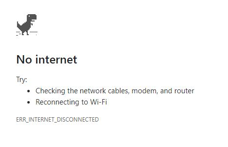
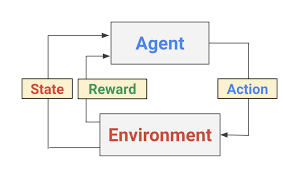

<h1 align="center">Dino neural network with reinforcement learning</h1>
<div align="center">
  <a href="https://jaydendao.com/dino">
    
  </a>
</div>

Teach the neural network model overcome obstacle and watch it improve with reinforcement learning. The chrome dino is a simple game which is available to everyone who uses the chrome browser. Which is the reason why it has been chosen as a good learning and testing environment. The uses of pixel data and user inputs can be used universally for any game played on a computer. The magic of reinforcement learning occurs with the action, state and reward. 

<div align="center">
  
</div>

# Tutorial
## Capture pixel data 
OpenCV is a widely used python package capturing and altering images.
To grab the full 1080p screen, downscale to 360p in grey scale 
```python
screen = grab_screen(region=0,0,1919,1079)
screen = cv2.cvtColor(screen, cv2.COLOR_BGR2GRAY)
screen = cv2.resize(screen, (640,360))
```
By making images in grey scale and downscaled will allow quicker training and processing of data. 

## Capture key inputs
```python
if win32api.GetAsyncKeyState(win32con.VK_UP) != 0:
    action = 1 
if win32api.GetAsyncKeyState(win32con.VK_DOWN) != 0:
    action = 2
if win32api.GetAsyncKeyState(0x51) != 0:
    done = True
```
Use  to assist with identifying key hex values.

## Prepare image and input data for machine learning
Data preparation is a critical step before being thrown into the machine learning model.
```python
# make data samples to an array
X = np.array([i[0] for i in training_data.values]).reshape(-1,HEIGHT,WIDTH, 1)

# create target labels are a one hot array
y = pd.get_dummies(training_data['label'].astype(int))

# split data into for training and testing
X_train, X_test, y_train, y_test = train_test_split(X, y, test_size=0.1, stratify=y, random_state=0)
```

## Neural Network Model
Using a simple neural network 
```python
def neural_network_model():
    # create layers for model
    model = keras.Sequential([
        keras.layers.Flatten(input_shape=[360, 640, 1]),
        keras.layers.BatchNormalization(),
        keras.layers.Dense(32, activation='relu'),
        keras.layers.Dense(32, activation='relu'),
        keras.layers.Dense(3, activation='softmax')
    ])
    # compile model for fitting
    model.compile(optimizer='adam',
                loss='categorical_crossentropy', 
                metrics=['accuracy'])
    # review the model
    print(model.summary())
    return model
```
Keep the input shape and output layer in mind. Input shape being the dimention of the image with [HEIGHT, WIDTH, COLOUR] as shown. Using one-hot arrays with an activation of softmax number of nodes are determined by the action being UP, DOWN, SPACE (3) in this example.

# Example
## Installation:
Open cmd and install dependencies
```elm
pip install -r requirements.txt
```

## Getting started
- Only supports windows 10 and python 3.5+
-	Open a chrome browser
-	Navigate to [chrome://dino](chrome://dino/)
```elm
python rawr.py
```
